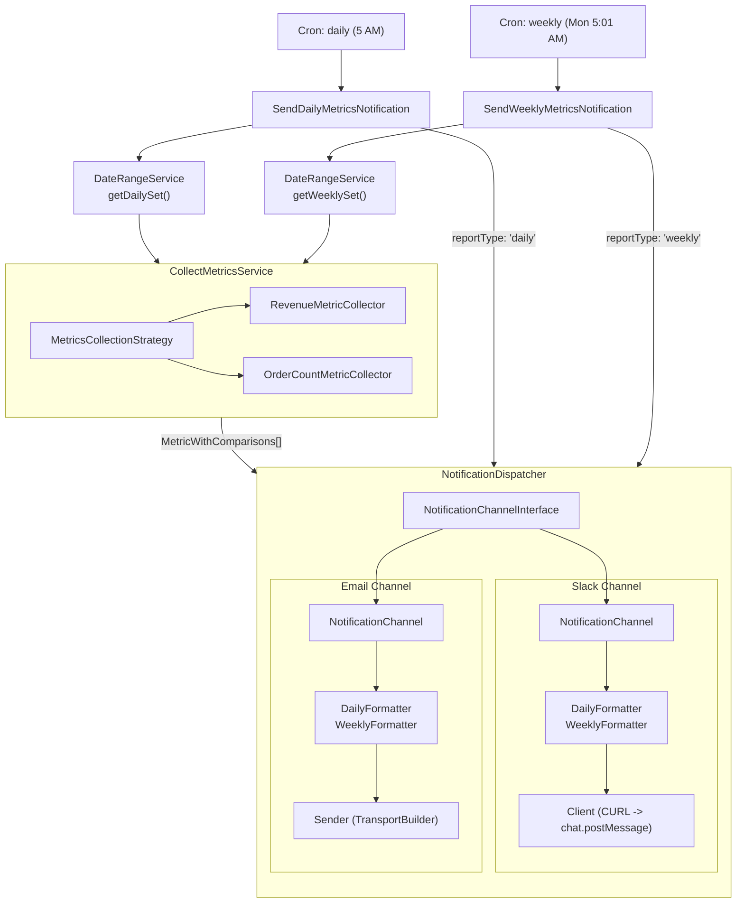

# Business Metrics Report

Automated daily and weekly business metric reports (revenue, order count) delivered to Slack and email, with week/month/year-over-year comparisons.

## 🚀 Features

- **📊 Daily & Weekly Reports** - two cron jobs report yesterday's metrics and the previous Mon-Sun week
- **📈 Historical Comparisons** - every metric is compared against week-ago, month-ago, and year-ago values
- **💬 Slack Notifications** - a Block Kit summary message, followed by the full detailed report as a thread reply
- **📧 Email Notifications** - an HTML report sent to any number of recipients via Magento's `TransportBuilder`
- **🔔 Fluctuation-Only Mode** - optionally skip notifications entirely unless a metric's week-over-week decline crosses a configurable threshold
- **🔌 Extensible Architecture** - add custom metric collectors, notification channels, and report formatters through clean interfaces

## 📋 Table of Contents

- [Installation](#-installation)
- [Configuration](#-configuration)
- [How It Works](#-how-it-works)
- [Extension Points](#-extension-points)
- [Architecture](#-architecture)
- [Contributing](#-contributing)
- [License](#-license)

## 📦 Installation

### Requirements

- Magento 2.4.x
- PHP 8.1 or higher
- Composer

### Install via Composer

```bash
composer require run_as_root/business-metrics-report
```

## ⚙️ Configuration

### Admin Configuration

Navigate to **Stores → Configuration → Run as Root → Business Metrics Report** to:

- Enable/disable the daily and weekly reports and set their cron schedules
- Enable/disable Slack notifications and set the bot token and channel ID
- Enable/disable email notifications and set the recipient list
- Set the fluctuation decline threshold and toggle fluctuation-only mode

| Field | Path | Default | Notes |
|---|---|---|---|
| Enable Daily/Weekly Report | `general/daily_enabled`, `general/weekly_enabled` | enabled | |
| Daily/Weekly Cron Schedule | `general/daily_cron_schedule`, `general/weekly_cron_schedule` | `0 5 * * *`, `1 5 * * 1` | |
| Fluctuation Decline Threshold (%) | `general/fluctuation_decline_threshold` | `-15` | Shared by the dispatcher-level gate and the Slack summary banner (see below) |
| Only Send on Fluctuation | `general/only_on_fluctuation` | disabled | When enabled, skips **all** channels for a run unless a metric's week-ago decline exceeds the threshold above |
| Enable Slack Notifications | `slack/enabled` | disabled | |
| Bot Token / Channel ID | `slack/bot_token`, `slack/channel_id` | - | Bot token needs the `chat:write` scope |
| Enable Email Notifications | `email/enabled` | disabled | |
| Recipients | `email/recipients` | - | Comma-separated |

### Cron Configuration

Two cron jobs are registered under the `default` cron group:

- `run_as_root_business_metrics_report_send_daily_notification` (default `0 5 * * *` - 5 AM)
- `run_as_root_business_metrics_report_send_weekly_notification` (default `1 5 * * 1` - 5:01 AM Monday)

## 🔍 How It Works

Each cron job runs the same pipeline: `DateRangeService` → `CollectMetricsService` → `NotificationDispatcher`.

### Date Ranges

Every report carries **four date ranges**: the current period plus three historical comparisons.

| Report | Current | Week ago | Month ago | Year ago |
|--------|---------|----------|-----------|----------|
| Daily | Yesterday | Same day -7 days | Same day -1 month | Same day -1 year |
| Weekly | Prev Mon-Sun | Week before last | Same week -4 weeks | Same week -52 weeks |

All dates use the **store timezone** (`Magento\Framework\Stdlib\DateTime\TimezoneInterface`).

### Metrics

Two collectors run per report, in sort-order:

| Metric | Code | Description |
|--------|------|--------------|
| Revenue | `revenue` | Sum of order grand totals for `processing` orders with a non-zero total |
| Order Count | `order_count` | Number of `processing` orders with a non-zero total |

Only orders with status `processing` and a non-zero grand total are included - both collectors share the same query filter chain. Additional exclusions (e.g. customer groups) can be added by registering a `MetricQueryFilterInterface` implementation - see [Add a Metric Collector](#add-a-metric-collector).

Metrics are aggregated across the **entire installation** - the built-in collectors do not filter by store or website. On a multi-store setup, reports show installation-wide totals, not per-store breakdowns.

Percentage change is calculated as `((current - historical) / historical) * 100`. If historical data is zero, the change is shown as `null` (no data). If both are zero, change is `0%`.

### Notification Channels

The dispatcher iterates all registered `NotificationChannelInterface` implementations. Channels that are disabled are skipped silently.

**Only send on fluctuation** - if `general/only_on_fluctuation` is enabled, the dispatcher checks every metric's week-ago comparison against `general/fluctuation_decline_threshold` (default `-15`, i.e. a 15% decline) *before* dispatching to any channel. If no metric declined past the threshold, **no channel is notified at all** for that run - not Slack, not email. If disabled (default), every scheduled run notifies all enabled channels regardless of fluctuation.

**Slack** - posts a Block Kit summary message via the Slack Web API (`chat.postMessage`), then posts the full detailed report as a thread reply. Independently of the dispatcher-level gate above, if any metric shows a decline past the same threshold vs the previous week, the Slack summary message itself includes a fluctuation warning banner. Requires a Bot token (`xoxb-...`) with `chat:write` scope and a channel ID.

**Email** - sends an HTML email (template `run_as_root_business_metrics_report`) to a comma-separated recipient list via Magento's `TransportBuilder`.

Both channels have separate `DailyFormatter` and `WeeklyFormatter` implementations selected by `reportType`.

## 🔧 Extension Points

All extension point interfaces live under `RunAsRoot\BusinessMetricsReport\Api\`.

### Add a Metric Collector

Implement `Api\MetricCollectorInterface` and register it:

```xml
<type name="RunAsRoot\BusinessMetricsReport\Service\CollectMetricsService">
    <arguments>
        <argument name="collectors" xsi:type="array">
            <item name="my_metric" xsi:type="object">Vendor\Module\Model\Collector\MyMetricCollector</item>
        </argument>
    </arguments>
</type>
```

```php
getMetricCode(): string       // unique identifier
getMetricLabel(): string      // human-readable label
getSortOrder(): int           // display order (lower = first)
collect(DateTimeInterface $start, DateTimeInterface $end): MetricResultInterface
```

### Add a Notification Channel

Implement `Api\NotificationChannelInterface` and register it:

```xml
<type name="RunAsRoot\BusinessMetricsReport\Service\NotificationDispatcher">
    <arguments>
        <argument name="channels" xsi:type="array">
            <item name="my_channel" xsi:type="object">Vendor\Module\Channel\MyNotificationChannel</item>
        </argument>
    </arguments>
</type>
```

### Add a Slack Report Formatter

Implement `Api\Channel\Slack\SlackReportFormatterInterface` and register it, then add a title:

```xml
<type name="RunAsRoot\BusinessMetricsReport\Channel\Slack\NotificationChannel">
    <arguments>
        <argument name="formatters" xsi:type="array">
            <item name="monthly" xsi:type="object">Vendor\Module\Channel\Slack\Formatter\MonthlyFormatter</item>
        </argument>
    </arguments>
</type>
<type name="RunAsRoot\BusinessMetricsReport\Channel\Slack\SummaryMessageBuilder">
    <arguments>
        <argument name="titles" xsi:type="array">
            <item name="monthly" xsi:type="string">📊 Monthly Business Metrics Report</item>
        </argument>
    </arguments>
</type>
```

### Add an Email Report Formatter

Implement `Api\Channel\Email\EmailReportFormatterInterface` (return `Api\Channel\Email\EmailFormattedReportInterface`) and register it:

```xml
<type name="RunAsRoot\BusinessMetricsReport\Channel\Email\NotificationChannel">
    <arguments>
        <argument name="formatters" xsi:type="array">
            <item name="monthly" xsi:type="object">Vendor\Module\Channel\Email\Formatter\MonthlyFormatter</item>
        </argument>
    </arguments>
</type>
```

### Swap the Collection Strategy

Override how metrics are collected by replacing the strategy via preference:

```xml
<preference for="RunAsRoot\BusinessMetricsReport\Api\MetricsCollectionStrategyInterface"
            type="Vendor\Module\Service\MyCollectionStrategy"/>
```

### Key Data Classes (`Api\Data\`)

| Class | Description |
|---|---|
| `DateRange` | Start/end `DateTimeImmutable` pair (UTC) |
| `DateRangeSet` | The four ranges passed to every collector |
| `ComparisonResult` | Percentage change + formatted current/historical values |
| `MetricResultInterface` | Single collected value |
| `MetricWithComparisonsInterface` | Metric value + all three historical comparisons |
| `MetricComparisonsInterface` | Week-ago, month-ago, year-ago results |

## 🏗️ Architecture



## 🤝 Contributing

We welcome contributions! Here's how you can help:

### Development Setup

1. Fork the repository
2. Clone your fork: `git clone https://github.com/your-username/business-metrics-report.git`
3. Create a feature branch: `git checkout -b feature/your-feature-name`

### Code Standards

- Follow Magento 2 / PSR-12 coding standards, enforced via `phpcs-ruleset.xml`
- Keep PHPStan level 8 clean (`phpstan.neon`) and PHPMD clean (`phpmd-ruleset.xml`)
- Write unit tests for new features
- Use meaningful commit messages

### Running Checks

```bash
vendor/bin/phpcs --standard=phpcs-ruleset.xml .
vendor/bin/phpstan analyse
vendor/bin/phpmd . text phpmd-ruleset.xml
vendor/bin/phpunit Test/Unit
```

### Pull Request Process

1. Ensure all checks above pass
2. Submit a pull request with a clear description
3. Respond to code review feedback

## 📄 License

This project is licensed under the MIT License - see the [LICENSE](LICENSE) file for details.
